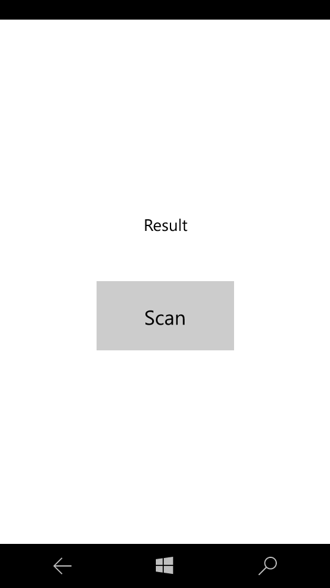
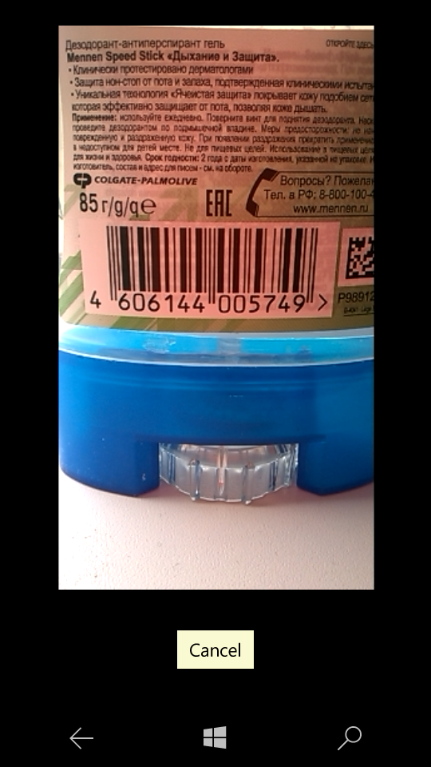

# Barcode and QRCode Scanner for UWP C#/XAML application

Add BarcodeScannerControl.xaml and BarcodeScannerControl.xaml.cs to your project
and popup to XAML page

        <Popup x:Name="BarcodePopup" IsOpen="False" IsLightDismissEnabled="False">
            <Grid>
                <local:BarcodeScannerControl x:Name="barcodecontrol"  Width="500" Height="500" />
            </Grid>
        </Popup>
        
And you will be able with simple code open popup and get scanned code:

        void BarcodeFound(string barcode)
        {
          // variable barcode containes string with barcode
            BarcodePopup.IsOpen = false;
        }

        void OnError(Exception e)
        {

        }

        private async void btnOpen_Click(object sender, RoutedEventArgs e)
        {
            BarcodePopup.IsOpen = true;
            await barcodecontrol.StartScan(BarcodeFound, OnError);
        }

Don't forget to handle suspending event, close popup and clean resources:
        
       private async void App_Suspending(object sender, Windows.ApplicationModel.SuspendingEventArgs e)
        {
            var deferral = e.SuspendingOperation.GetDeferral();
            await barcodecontrol.Cleanup();
            BarcodePopup.IsOpen = false;
            deferral.Complete();
        }
        

